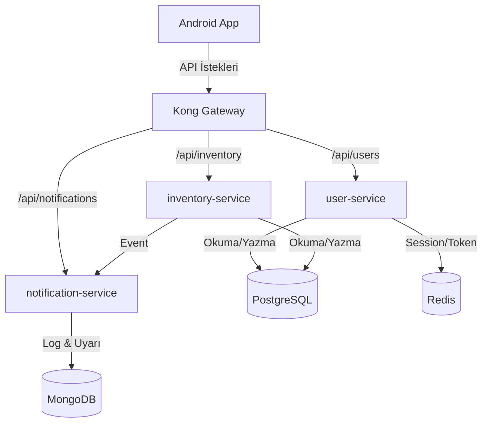
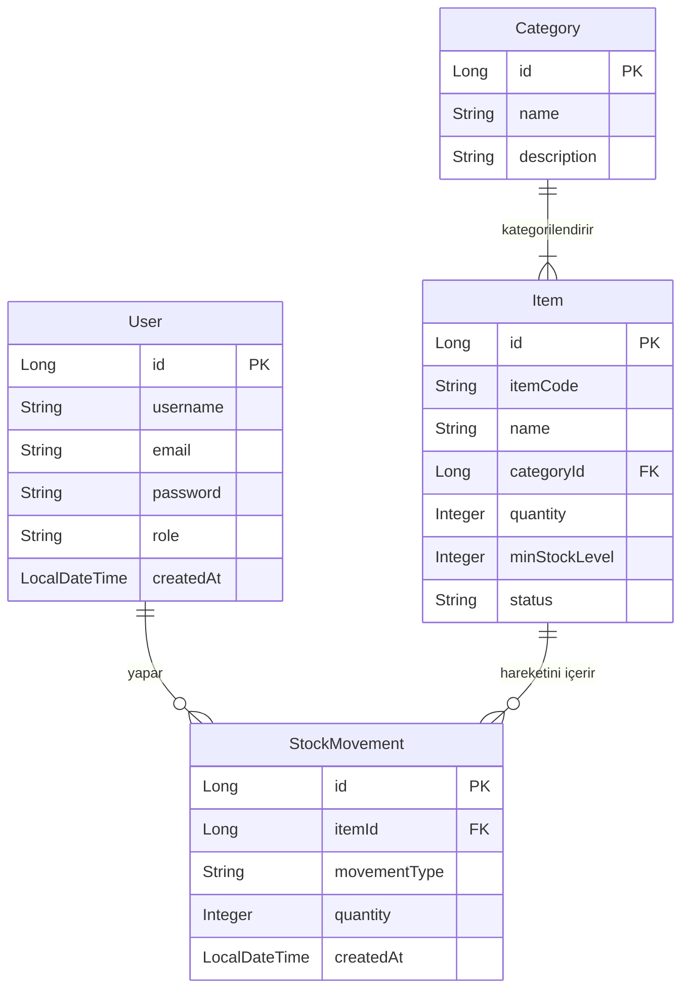
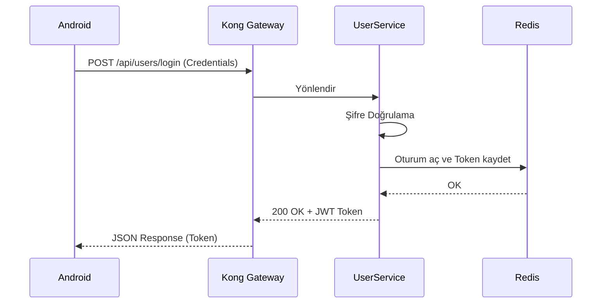
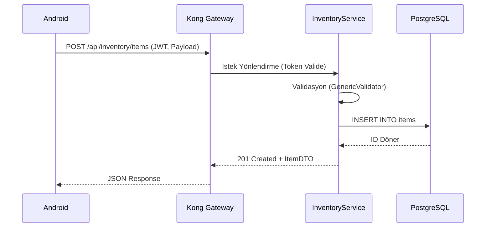
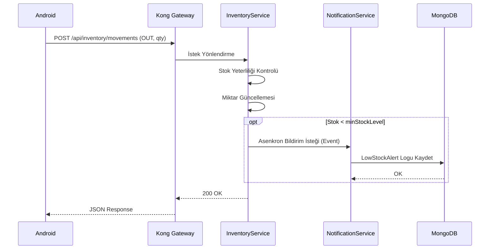

# Campus Management System

> **Kocaeli Üniversitesi — İleri Java Uygulamaları (TBL324)**
> Dr. Öğr. Üyesi Samet Diri | 2 Kişilik Ekip

---

## 📋 İçindekiler

1. [Proje Özeti](#1-proje-özeti)
2. [Sistem Mimarisi](#2-sistem-mimarisi)
3. [Veritabanı Şeması](#3-veritabanı-şeması)
4. [API Akış Diyagramı](#4-api-akış-diyagramı)
5. [Mikroservis Detayları](#5-mikroservis-detayları)
6. [Android Canvas Grafikleri](#6-android-canvas-grafikleri)
7. [Docker Compose](#7-docker-compose)
8. [Performans Test Raporu](#8-performans-test-raporu)
9. [TDD Akışı](#9-tdd-akışı)
10. [Kurulum](#10-kurulum)
11. [Puan Değerlendirmesi](#11-puan-değerlendirmesi)

---

## 1. Proje Özeti

> ⚠️ *Bu bölüm doldurulacak.*

---

## 2. Sistem Mimarisi

### 🌐 Mikroservisler ve Ağ Geçidi İletişimi
Aşağıdaki diyagram, Android uygulamasından gelen isteklerin Kong Gateway üzerinden mikroservislere ve veritabanlarına nasıl dağıldığını gösterir.



---

## 3. Veritabanı Şeması

### 🗄️ Varlık-İlişki (ER) Diyagramı
Aşağıdaki ER diyagramı, ilişkisel veritabanında (PostgreSQL) tutulan ana tabloları, alanlarını ve aralarındaki bağlantıları temsil eder.



---

## 4. API Akış Diyagramı

### 🔄 Kritik Senaryolar Sequence Diyagramları

#### 1. Kullanıcı Girişi (Login Akışı)
Kullanıcının kimlik doğrulaması yapıp Redis üzerinde session açması süreci.


#### 2. Yeni Ürün Ekleme (Create Item)
Sisteme yetkili bir kullanıcının yeni bir stok kalemi eklemesi.


#### 3. Stok Hareketi ve Uyarı (Stock Movement)
Stok düştüğünde MongoDB üzerine uyarı loglanması.


---

## 5. Mikroservis Detayları

> ⚠️ *Class diyagramları eklenecek.*

---

## 6. Android Canvas Grafikleri

> ⚠️ *CustomView açıklamaları eklenecek.*

---

## 7. Docker Compose

```bash
# Tüm servisleri başlat
docker-compose up --build

# Servisleri durdur ve volume'ları temizle
docker-compose down -v
```

> ⚠️ *docker-compose.yml detayları eklenecek.*

---

## 8. Performans Test Raporu

> ⚠️ *k6 test sonuçları eklenecek.*

---

## 9. TDD Akışı

> ⚠️ *Red-Green-Refactor döngüsü ve commit zaman çizelgesi eklenecek.*

---

## 10. Kurulum

### Gereksinimler

| Araç | Versiyon |
|------|----------|
| Java | 17 |
| Maven | 3.9.x |
| Docker | 24.x |
| Docker Compose | 2.24.x |
| Android SDK | 34 |

### Hızlı Başlangıç

```bash
# 1. Repo'yu klonla
git clone https://github.com/[USERNAME]/campus-management-system.git
cd campus-management-system

# 2. Develop branch'e geç
git checkout develop

# 3. Docker ile başlat
docker-compose up --build
```

---

## 11. Puan Değerlendirmesi

| Kriter | Puan | Durum |
|--------|------|-------|
| API + Mikroservis Mimarisi | 20 pt | ⏳ |
| Generic Yapılar | 10 pt | ⏳ |
| Mobil GUI (Custom + Android) | 15 pt | ⏳ |
| JDBC + NoSQL | 10 pt | ⏳ |
| SOLID & OOP | 10 pt | ⏳ |
| Hata Yönetimi | 5 pt | ⏳ |
| Performans Testleri | 5 pt | ⏳ |
| Analiz & Doküman | 5 pt | ⏳ |
| Docker Compose | +5 pt | ⏳ |
| TDD | +10 pt | ⏳ |
| Gateway | +5 pt | ⏳ |
| **Toplam** | **100 pt** | ⏳ |

---

> **Son Güncelleme:** 2026-05-12
> **Proje:** Campus Management System — TBL324
