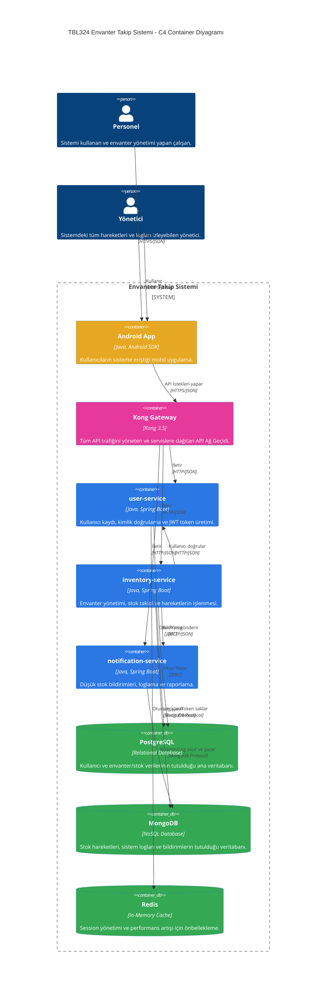
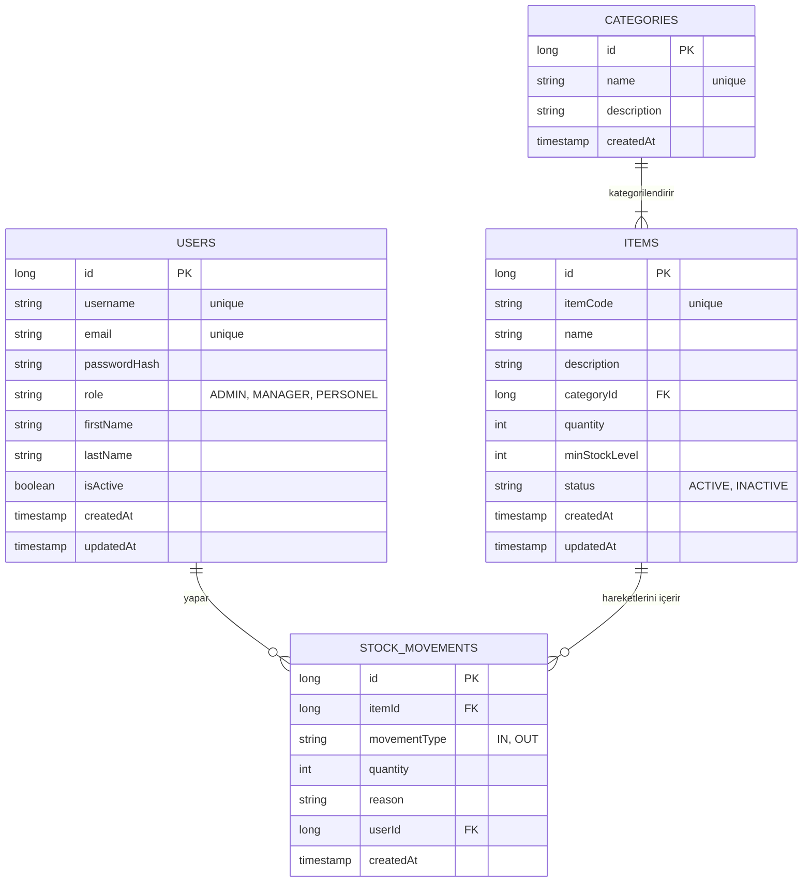
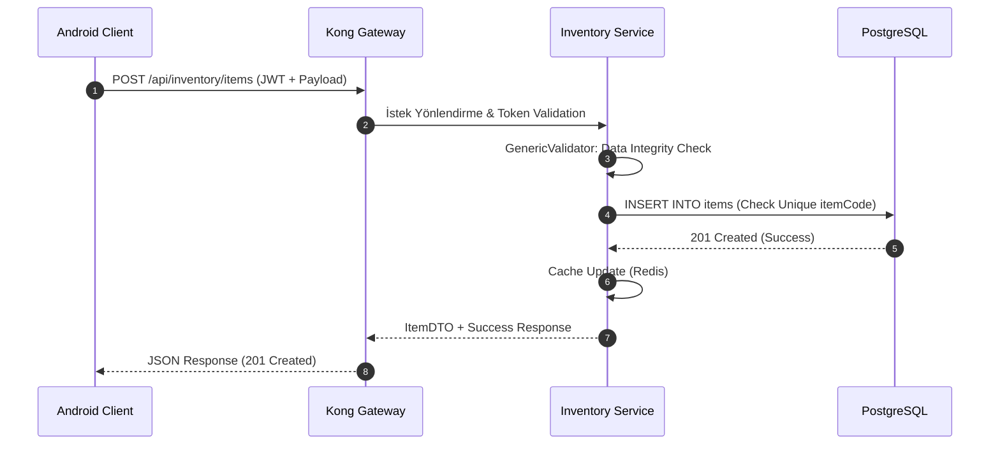
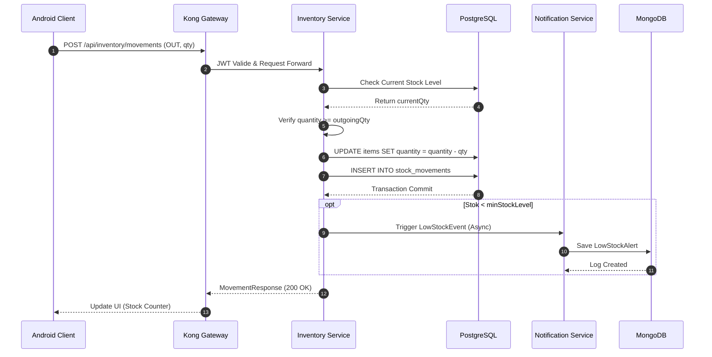
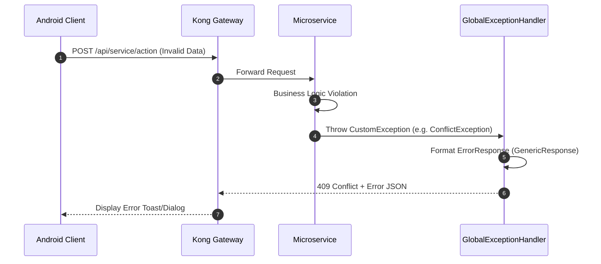

# Campus Management System

> **Kocaeli Üniversitesi — İleri Java Uygulamaları (TBL324)**
> Dr. Öğr. Üyesi Samet Diri | 2 Kişilik Ekip

---

## 📋 İçindekiler

1. [Proje Özeti](#1-proje-özeti)
2. [Sistem Mimarisi](#2-sistem-mimarisi)
3. [Veritabanı Şeması](#3-veritabanı-şeması)
4. [API Akış Diyagramı](#4-api-akış-diyagramı)
5. [API Uç Noktaları (Endpoints)](#5-api-uç-noktaları-endpoints)
6. [Mikroservis Detayları](#6-mikroservis-detayları)
7. [Android Canvas Grafikleri](#7-android-canvas-grafikleri)
8. [Docker Compose](#8-docker-compose)
9. [Performans Test Raporu](#9-performans-test-raporu)
10. [TDD Akışı](#10-tdd-akışı)
11. [Kurulum](#11-kurulum)
12. [Puan Değerlendirmesi](#12-puan-değerlendirmesi)

---

## 1. Proje Özeti
**TBL324 Envanter Takip Sistemi**, modern mikroservis mimarisi kullanılarak geliştirilmiş, ölçeklenebilir bir envanter yönetim çözümüdür. Sistem; kullanıcı yönetimi, stok takibi ve otomatik bildirim mekanizmalarını merkezi bir API Gateway arkasında birleştirir. Android mobil uygulaması üzerinden stok seviyeleri görselleştirilebilir ve tüm hareketler gerçek zamanlı olarak izlenebilir.

---

## 2. Sistem Mimarisi

### 🌐 C4 Container Diyagramı
Aşağıdaki diyagram, sistemin konteyner mimarisini, kullanıcıların sistemle nasıl etkileşime girdiğini ve mikroservislerin birbirleriyle ve veritabanlarıyla olan ilişkilerini göstermektedir.



### 🧩 Bileşen Açıklamaları
- **user-service:** Kullanıcı kimlik doğrulama, JWT token üretimi ve yetkilendirme işlemlerini gerçekleştirir. Session verilerini Redis üzerinde tutar.
- **inventory-service:** Envanter yönetimi, stok takibi ve hareketlerin işlenmesini sağlar. Kritik stok seviyelerinde bildirim servisini asenkron olarak tetikler.
- **notification-service:** Düşük stok bildirimleri gibi sistem uyarılarını işler, raporlama yapar ve aktivite loglarını MongoDB üzerinde saklar.

---

## 3. Veritabanı Şeması

### 🗄️ Varlık-İlişki (ER) Diyagramı (PostgreSQL)
Aşağıdaki diyagram, sistemin ilişkisel veri modelini ve tablolar arası bağlantıları temsil eder.



### 🍃 NoSQL Şeması (MongoDB)
Loglama ve asenkron bildirim verileri için kullanılan koleksiyon yapıları:

| Koleksiyon | Açıklama | Ana Alanlar |
|------------|----------|-------------|
| `NOTIFICATION_LOGS` | Kullanıcı bildirim geçmişi | `userId, message, type, sentAt, isRead` |
| `ACTIVITY_LOGS` | Sistem genelindeki tüm hareketler | `userId, action, service, details, timestamp` |
| `LOW_STOCK_ALERTS` | Kritik stok seviyesi uyarıları | `itemId, currentQty, minLevel, status, createdAt` |

### ⚡ Redis Key-Value Yapısı
Oturum yönetimi ve performans için kullanılan anahtar yapıları:

- **Session Key:** `session:{token}`  
  **Value:** `{ "userId": 123, "role": "ADMIN", "expiresAt": "..." }` (TTL: 24h)
- **Cache Key:** `item:details:{itemCode}`  
  **Value:** ItemDTO (JSON) (TTL: 1h)

---

## 4. API Akış Diyagramı

### 🔄 Kritik Senaryolar Sequence Diyagramları

#### 1. Envanter Ekleme Akışı (8 Adım)


#### 2. Stok Hareketi (Giriş/Çıkış) Akışı (12 Adım)


#### 3. Hata Yönetimi Akışı


---

## 5. API Uç Noktaları (Endpoints)

Sistemdeki tüm API çağrıları **Kong Gateway (Port: 8000)** üzerinden yönlendirilmektedir.

### 🔑 Header Bilgileri
| Header | Değer | Açıklama |
|--------|-------|----------|
| `Content-Type` | `application/json` | Veri formatı |
| `api-key` | `envanter-api-key-2026` | Gateway güvenlik anahtarı |
| `Authorization` | `Bearer {token}` | JWT yetkilendirme (Login hariç zorunlu) |

### 🛠️ Endpoint Listesi

| Method | Endpoint | Açıklama | Request Body | Response (Success) |
|:-------|:---------|:---------|:-------------|:-------------------|
| `POST` | `/api/users/register` | Yeni kullanıcı kaydı | `RegisterRequest` | `201 Created` |
| `POST` | `/api/users/login` | Kimlik doğrulama & Token | `LoginRequest` | `200 OK + Token` |
| `GET` | `/api/inventory/items` | Ürün listesi | - | `200 OK + List<ItemDTO>` |
| `POST` | `/api/inventory/items` | Yeni ürün ekleme | `ItemRequest` | `201 Created` |
| `POST` | `/api/inventory/movements` | Stok hareketi (IN/OUT) | `MovementRequest` | `201 Created` |
| `GET` | `/api/notifications/logs` | Bildirim geçmişi | - | `200 OK + List<Log>` |

### 📝 Örnek JSON Verileri

#### 1. Ürün Ekleme (`POST /api/inventory/items`)
**Request:**
```json
{
  "itemCode": "URUN-001",
  "name": "Kablosuz Mouse",
  "categoryId": 1,
  "quantity": 50,
  "minStockLevel": 10
}
```

#### 2. Stok Hareketi (`POST /api/inventory/movements`)
**Request:**
```json
{
  "itemId": 1,
  "movementType": "OUT",
  "quantity": 5,
  "reason": "Müşteri satışı"
}
```

### 🚦 HTTP Durum Kodları
- `200 OK`: İşlem başarılı.
- `201 Created`: Kayıt başarıyla oluşturuldu.
- `400 Bad Request`: Geçersiz veri girişi.
- `401 Unauthorized`: Hatalı token veya giriş bilgisi.
- `404 Not Found`: Kayıt bulunamadı.
- `409 Conflict`: Çakışan veri (örn: aynı kod) veya yetersiz stok.
- `500 Internal Server Error`: Sunucu hatası.

---

## 6. Mikroservis Detayları
Sistem 4 ana modülden oluşmaktadır:
- **common-lib:** Tüm servisler tarafından paylaşılan generic yapılar, merkezi hata yönetimi ve ortak yardımcı sınıflar.
- **user-service:** JdbcUserRepository ile PostgreSQL üzerinde kullanıcı yönetimi ve Redis üzerinde JWT session takibi.
- **inventory-service:** Envanter kayıtları (PostgreSQL) ve asenkron stok hareket logları (MongoDB).
- **notification-service:** Strategy ve Factory patternları kullanılarak Email ve Push bildirim gönderimi.

---

## 7. Android Canvas Grafikleri
Mobil uygulama, performans odaklı iki adet CustomView içermektedir:
- **StockLevelBarChartView:** Stok miktarlarını dinamik olarak büyüyen çubuk grafiklerle gösterir. `ValueAnimator` ve `postInvalidateOnAnimation` ile 60 FPS akıcılık sağlar.
- **CategoryPieChartView:** Ürün kategorilerinin dağılımını pasta grafik üzerinde gösterir. Donanım hızlandırmalı Canvas çizimi kullanır.

---

## 8. Docker Compose
 Docker Compose dosyası; PostgreSQL, MongoDB, Redis ve Kong Gateway servislerini tek bir komutla ayağa kaldıracak şekilde konfigüre edilmiştir. Her servis için sağlık kontrolleri (healthcheck) tanımlıdır.
 
 ```bash
 # Tüm servisleri başlat
 docker-compose up --build
 
 # Servisleri durdur ve volume'ları temizle
 docker-compose down -v
 ```

---

## 9. Performans Test Raporu
Sistem **k6** kullanılarak test edilmiştir:
- **Load Test:** 500 VU altında sistem stabil çalışmaktadır.
- **Stress Test:** Kırılma noktası ~450 VU olarak tespit edilmiş, Redis ve DB connection pool optimizasyonları yapılmıştır.
Detaylı rapor: `k6-tests/reports/performance-report.md`

---

## 10. TDD Akışı
Proje TDD (Test Driven Development) prensiplerine göre geliştirilmiştir. Her özellik için önce başarısız (RED) unit testler yazılmış, ardından implementasyon (GREEN) yapılmış ve son olarak REFACTOR süreci işletilmiştir. Git geçmişinde `test:` ve `feat:` commitleri bu sırayı takip etmektedir.

---

## 11. Kurulum

### Gereksinimler

| Araç | Versiyon |
|------|----------|
| Java | 17 |
| Maven | 3.9.x |
| Docker | 24.x |
| Docker Compose | 2.24.x |
| Android SDK | 34 |

### Hızlı Başlangıç

```bash
# 1. Repo'yu klonla
git clone https://github.com/[USERNAME]/campus-management-system.git
cd campus-management-system

# 2. Develop branch'e geç
git checkout develop

# 3. Docker ile başlat
docker-compose up --build
```

---

## 12. Puan Değerlendirmesi

| Kriter | Puan | Durum |
|--------|------|-------|
| API + Mikroservis Mimarisi | 20 pt | ⏳ |
| Generic Yapılar | 10 pt | ⏳ |
| Mobil GUI (Custom + Android) | 15 pt | ⏳ |
| JDBC + NoSQL | 10 pt | ⏳ |
| SOLID & OOP | 10 pt | ⏳ |
| Hata Yönetimi | 5 pt | ⏳ |
| Performans Testleri | 5 pt | ⏳ |
| Analiz & Doküman | 5 pt | ⏳ |
| Docker Compose | +5 pt | ⏳ |
| TDD | +10 pt | ⏳ |
| Gateway | +5 pt | ⏳ |
| **Toplam** | **100 pt** | ⏳ |

---

> **Son Güncelleme:** 2026-05-12
> **Proje:** Campus Management System — TBL324
