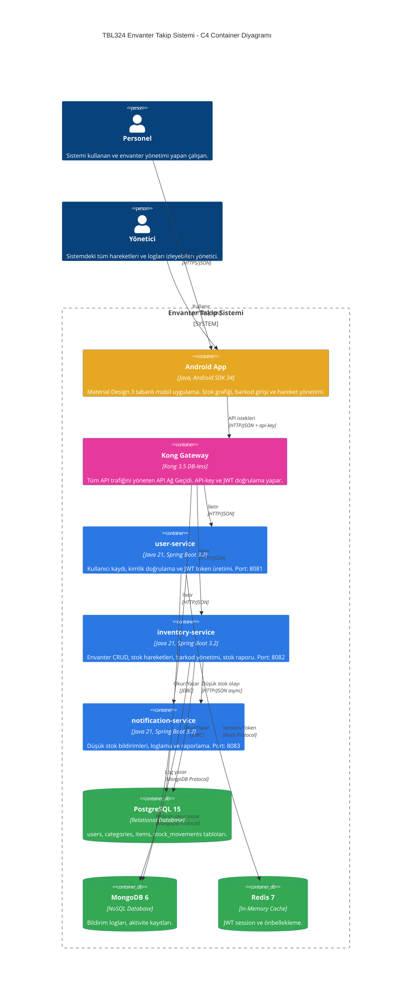
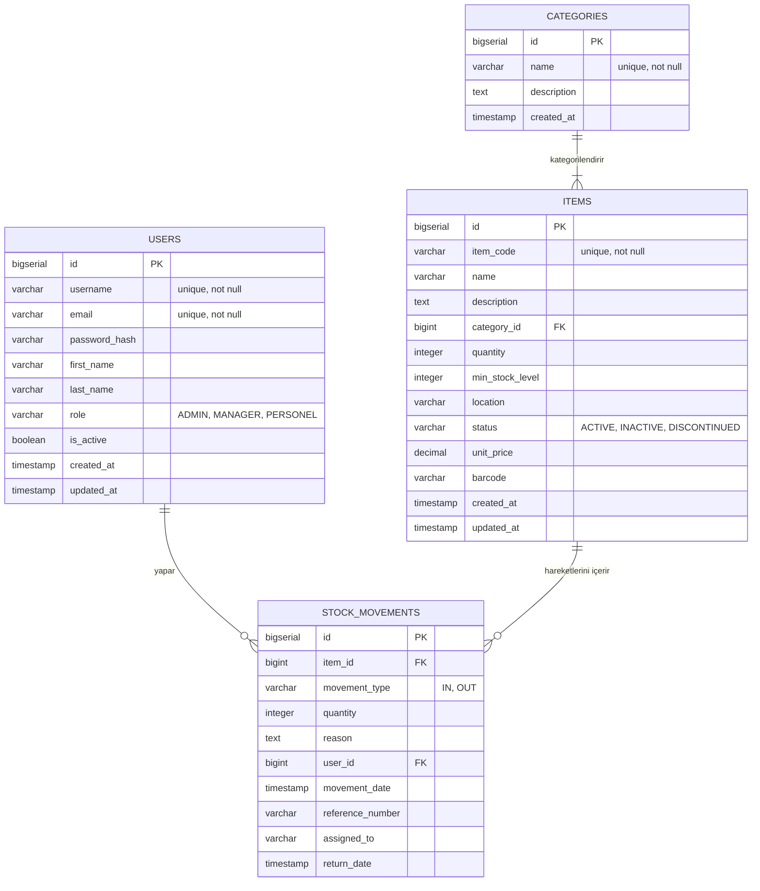
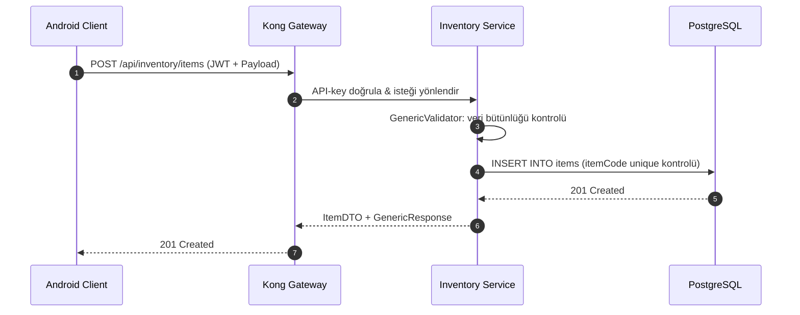
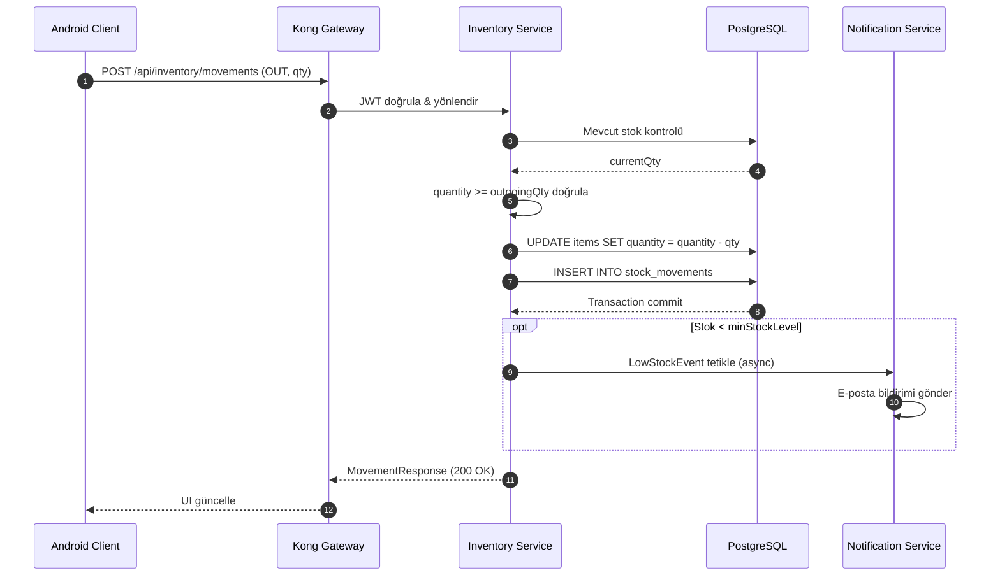

# TBL324 Envanter Takip Sistemi


> **Kocaeli Üniversitesi — İleri Java Uygulamaları (TBL324)**
> Dr. Öğr. Üyesi Samet Diri | Final Projesi
>
> **Geliştirici Ekibi:**
> - **Efekan Demir** (Üye 1) --231307054
> - **Oktay** (Üye 2) -- 231307074

---

## İçindekiler

1. [Proje Özeti](#1-proje-özeti)
2. [Proje Yapısı](#2-proje-yapısı)
3. [Sistem Mimarisi](#3-sistem-mimarisi)
4. [Veritabanı Şeması](#4-veritabanı-şeması)
5. [API Akış Diyagramı](#5-api-akış-diyagramı)
6. [API Uç Noktaları](#6-api-uç-noktaları)
7. [Mikroservis Detayları](#7-mikroservis-detayları)
8. [Android Mobil Uygulama](#8-android-mobil-uygulama)
9. [Docker Compose](#9-docker-compose)
10. [Performans Testleri](#10-performans-testleri)
11. [TDD Akışı](#11-tdd-akışı)
12. [Kurulum ve Çalıştırma](#12-kurulum-ve-çalıştırma)
13. [Puan Değerlendirmesi](#13-puan-değerlendirmesi)

---

## 1. Proje Özeti

**TBL324 Envanter Takip Sistemi**, modern mikroservis mimarisi kullanılarak geliştirilmiş, ölçeklenebilir bir envanter yönetim çözümüdür. Sistem; kullanıcı yönetimi, stok takibi ve otomatik bildirim mekanizmalarını merkezi bir API Gateway arkasında birleştirir. Android mobil uygulaması üzerinden stok seviyeleri gerçek zamanlı görselleştirilebilir, ürünler barkod alanıyla yönetilebilir ve tüm hareketler kayıt altına alınabilir.

---

## 2. Proje Yapısı

```
Inventory_System/
├── android-app/                  # Android mobil istemci (Java, SDK 34)
│   └── app/src/main/
│       ├── java/com/envanter/android/
│       │   ├── LoginActivity.java
│       │   ├── DashboardActivity.java
│       │   ├── EnvanterListActivity.java
│       │   ├── adapter/EnvanterAdapter.java
│       │   ├── api/              # Retrofit ApiClient & ApiService
│       │   ├── model/            # DTO sınıfları (ItemDTO, CategoryDTO, vb.)
│       │   └── util/             # ApiErrorHandler
│       └── res/layout/           # XML layout dosyaları
├── common-lib/                   # Paylaşılan kütüphane (JWT, GenericResponse, vb.)
│   └── src/main/java/com/envanter/common/
│       ├── security/             # JwtTokenProvider, JwtAuthenticationFilter
│       ├── dto/                  # GenericResponse<T>
│       └── exception/            # GlobalExceptionHandler, özel exception sınıfları
├── user-service/                 # Kullanıcı & kimlik doğrulama servisi (port 8081)
├── inventory-service/            # Envanter & stok yönetimi servisi (port 8082)
├── notification-service/         # Bildirim & log servisi (port 8083)
├── init-scripts/
│   └── 01-init.sql               # PostgreSQL şema ve seed data
├── kong-config/
│   └── kong.yml                  # Kong DB-less declarative config
├── k6-tests/                     # Performans test scriptleri
├── docker-compose.yml            # Tüm servisleri ayağa kaldıran orkestrasyon dosyası
├── pom.xml                       # Maven multi-module root POM
└── openapi.yaml                  # OpenAPI 3.0 API tanımı
```

---

## 3. Sistem Mimarisi

### C4 Container Diyagramı



### Bileşen Açıklamaları

| Bileşen | Teknoloji | Sorumluluk |
|---------|-----------|------------|
| **common-lib** | Java 21 | JWT filter/provider, GenericResponse, GlobalExceptionHandler |
| **user-service** | Spring Boot 3.2, JDBC, Redis | Kimlik doğrulama, JWT üretimi, kullanıcı yönetimi |
| **inventory-service** | Spring Boot 3.2, JDBC, MongoDB | Ürün CRUD, stok hareketleri, barkod, stok raporu |
| **notification-service** | Spring Boot 3.2, MongoDB, Mailhog | Düşük stok bildirimleri, e-posta, log |
| **Kong Gateway** | Kong 3.5 DB-less | API-key auth, rate limiting, servis yönlendirme |
| **Android App** | Java, SDK 34, Retrofit2 | Material Design 3 UI, gerçek zamanlı stok grafiği |

---

## 4. Veritabanı Şeması

### ER Diyagramı (PostgreSQL)



### NoSQL Şeması (MongoDB)

| Koleksiyon | Açıklama | Ana Alanlar |
|------------|----------|-------------|
| `NOTIFICATION_LOGS` | Bildirim geçmişi | `userId, message, type, sentAt, isRead` |
| `ACTIVITY_LOGS` | Sistem aktivite kayıtları | `userId, action, service, details, timestamp` |
| `LOW_STOCK_ALERTS` | Düşük stok uyarıları | `itemId, currentQty, minLevel, status, createdAt` |

### Redis Key Yapısı

| Key Pattern | Değer | TTL |
|-------------|-------|-----|
| `session:{token}` | `{ userId, role, expiresAt }` | 24 saat |
| `item:details:{itemCode}` | ItemDTO (JSON) | 1 saat |

---

## 5. API Akış Diyagramı

### Envanter Ekleme Akışı



### Stok Hareketi Akışı



---

## 6. API Uç Noktaları

Tüm istekler **Kong Gateway (Port 8000)** üzerinden yapılır.

### Header Bilgileri

| Header | Değer | Zorunlu |
|--------|-------|---------|
| `Content-Type` | `application/json` | Evet |
| `api-key` | `envanter-api-key-2026` | Evet |
| `Authorization` | `Bearer {token}` | Login hariç |

### Endpoint Listesi

| Method | Endpoint | Açıklama | Auth |
|--------|----------|----------|------|
| `POST` | `/api/users/register` | Yeni kullanıcı kaydı | Hayır |
| `POST` | `/api/users/login` | JWT token al | Hayır |
| `GET` | `/api/inventory/items` | Ürün listesi (filtreli) | JWT |
| `POST` | `/api/inventory/items` | Yeni ürün ekle | JWT |
| `PUT` | `/api/inventory/items/{id}` | Ürün güncelle (barkod dahil) | JWT |
| `DELETE` | `/api/inventory/items/{id}` | Ürün sil (soft-delete) | JWT |
| `GET` | `/api/inventory/items/report` | Stok raporu (toplam, düşük stok) | JWT |
| `GET` | `/api/inventory/categories` | Kategori listesi | JWT |
| `POST` | `/api/inventory/categories` | Yeni kategori ekle | JWT |
| `POST` | `/api/inventory/movements` | Stok hareketi (IN/OUT) | JWT |
| `GET` | `/api/inventory/movements/{itemId}` | Ürün hareket geçmişi | JWT |
| `GET` | `/api/notifications/health` | Servis sağlık kontrolü | Hayır |

### Hata Yönetimi

Tüm servisler `GlobalExceptionHandler` (`@RestControllerAdvice`) ile merkezi hata yönetimi yapar. HTTP durum kodları standart RFC'ye uyar:

| Exception | HTTP Kodu | Açıklama |
|-----------|----------|----------|
| `ResourceNotFoundException` | 404 | Kayıt bulunamadı |
| `ConflictException` | 409 | Çakışan veri (ör: aynı itemCode) |
| `ValidationException` | 400 | Geçersiz giriş (GenericValidator) |
| `BadRequestException` | 400 | Hatalı istek formatı |
| `UnauthorizedException` | 401 | Geçersiz/süresi dolmuş JWT |
| `ForbiddenException` | 403 | Yetkisiz erişim |
| Spring `MethodArgumentNotValidException` | 400 | Bean validation hatası |
| Beklenmedik exception | 500 | Genel sunucu hatası |

```json
// Hata yanıt formatı (GenericResponseWrapper):
{
  "success": false,
  "message": "Bu item kodu zaten mevcut: ITM-001",
  "data": null,
  "timestamp": "2026-05-15T18:30:00"
}
```

### Örnek İstekler

**Ürün Ekleme:**
```json
POST /api/inventory/items
{
  "itemCode": "LAPTOP-001",
  "name": "Dell Latitude 5540",
  "categoryId": 1,
  "quantity": 15,
  "minStockLevel": 3,
  "location": "Depo A-2",
  "unitPrice": 24999.99,
  "barcode": "8691234567890"
}
```

**Stok Hareketi:**
```json
POST /api/inventory/movements
{
  "itemId": 1,
  "movementType": "OUT",
  "quantity": 2,
  "reason": "IT departmanı talebi",
  "assignedTo": "Ahmet Yılmaz",
  "referenceNumber": "IT-2026-042"
}
```

---

## 7. Mikroservis Detayları

### common-lib — Generic Yapılar

Tüm servisler tarafından paylaşılan kütüphane. **Generic<T> yapıları** burada merkezileştirilmiştir:

| Sınıf | Tip Parametresi | Açıklama |
|-------|----------------|----------|
| `GenericResponseWrapper<T>` | `<T>` | Tüm API yanıtlarını saran sarmalayıcı. Static factory: `success(T data)`, `error(String msg)`. Builder pattern dahil. |
| `GenericRepository<T, ID>` | `<T, ID>` | CRUD kontrat interface'i. `findById`, `findAll`, `save`, `deleteById`, `existsById`. |
| `GenericValidator<T>` | `<T>` | Tip güvenli doğrulama zinciri. `ValidationResult` ile birden fazla hata toplanır. |
| `GenericPaginator<T>` | `<T>` | Sayfalama yardımcısı — koleksiyon dilimleme. |

```java
// Kullanım örneği — her mikroservis controller'ında:
GenericResponseWrapper<List<ItemDTO>> response = GenericResponseWrapper.success(items);
// → { "data": [...], "message": "Islem basarili.", "success": true, "timestamp": "..." }
```

**Security:**
- `JwtTokenProvider` — HS384 ile token üretimi ve doğrulama
- `JwtAuthenticationFilter` — Spring Security OncePerRequestFilter

> **Not:** Servisler `@SpringBootApplication(scanBasePackages = {"com.envanter.<servis>", "com.envanter.common"})` ile common-lib bean'lerini otomatik algılar.

### user-service (Port 8081)
- `JdbcUserRepository` — JDBC ile PostgreSQL kullanıcı işlemleri
- BCrypt şifre hashleme
- Redis üzerinde JWT session yönetimi
- Rol tabanlı yetkilendirme: `ADMIN`, `MANAGER`, `PERSONEL`

### inventory-service (Port 8082)
- `JdbcItemRepository` — JDBC ile envanter CRUD
- `ItemMapper` — SRP prensibiyle DTO/Entity dönüşümleri
- Barkod alanı desteği (`barcode VARCHAR(100)`)
- Stok hareketi: `assigned_to`, `reference_number`, `return_date` alanları
- `/api/inventory/items/report` — aktif ürün sayısı + düşük stok sayısı

### notification-service (Port 8083) — SOLID & OOP Design Patterns

**SOLID Prensipleri:**

| Prensip | Uygulama |
|---------|----------|
| **S** — Single Responsibility | `ItemMapper` yalnızca DTO↔Entity dönüşümü yapar; servis iş mantığından ayrı. |
| **O** — Open/Closed | `NotificationStrategy` interface'i kapatılmış; `EmailSenderStrategy` / `PushNotificationStrategy` genişletme sağlar. Yeni kanal eklemek için mevcut kod değişmez. |
| **L** — Liskov Substitution | `JdbcItemRepository`, `JdbcUserRepository` → `GenericRepository<T,ID>` sözleşmesini tam olarak karşılar. |
| **I** — Interface Segregation | `ItemRepository`, `CategoryRepository`, `StockMovementRepository` ayrı interface'ler; birbirinden bağımsız. |
| **D** — Dependency Inversion | Tüm servislerde constructor injection zorunlu, `@Autowired` field injection yasak. Controller → Service interface'ine bağlı, somut sınıfa değil. |

**Design Patterns:**

```
Strategy Pattern:
  NotificationStrategy (interface)
      ├── EmailSenderStrategy    → Mailhog SMTP
      └── PushNotificationStrategy → Firebase stub

Factory Pattern:
  NotificationFactory.createStrategy("EMAIL"|"PUSH"|"LOW_STOCK")
      → Spring singleton bean döner; switch-on-type OCP ile yönetilir.

Builder Pattern:
  GenericResponseWrapper.Builder<T>
      .data(dto).message("OK").success(true).build()
```

- MongoDB ile bildirim ve aktivite logları (`NotificationLog`, `ActivityLog`, `LowStockAlert`)
- Mailhog SMTP entegrasyonu (geliştirme ortamı, port 1025/8025)

---

## 8. Android Mobil Uygulama

### Ekranlar

| Ekran | Açıklama |
|-------|----------|
| `LoginActivity` | Material Design 3 giriş ekranı, JWT token yönetimi |
| `DashboardActivity` | Toplam ürün, düşük stok, kategori sayaçları + `StockLevelBarChartView` |
| `EnvanterListActivity` | RecyclerView ile ürün listesi, SwipeRefresh, FAB ile ürün ekleme |

### Teknik Özellikler
- **Retrofit2 + Gson** — HTTP istemci ve JSON serileştirme
- **Material Design 3** — `MaterialCardView`, `MaterialButton`, `TextInputLayout`
- **EnvanterAdapter** — `OnItemClickListener` interface ile düzenle/sil/hareket butonları
- Düşük stok durumunda kırmızı badge (< `minStockLevel`), yeterli stokta yeşil badge

### Custom Graphics — StockLevelBarChartView

`com.envanter.mobile.view.StockLevelBarChartView`, standart Android bileşeni **değildir**; `android.view.View` sınıfından türetilmiş, tümüyle `android.graphics.Canvas` API'si ile elle çizilmiş özel bir grafik bileşenidir:

```
StockLevelBarChartView extends View
  ├── onDraw(Canvas)        → X/Y eksenleri, renkli barlar, etiketler
  ├── onMeasure()           → wrap_content / match_parent desteği
  ├── Paint nesneleri       → barPaint, textPaint, axisPaint, minStockLinePaint (DashPathEffect)
  ├── ValueAnimator         → 800ms AccelerateDecelerate interpolasyon (60 FPS)
  └── Renk mantığı          → Yeşil (≥1.5×min) / Turuncu (≥min) / Kırmızı (<min) + kritik border
```

- `DashPathEffect` ile kesikli minimum stok çizgisi
- `postInvalidateOnAnimation()` ile hardware-safe animasyon
- Kritik ürünlerde kırmızı dış çerçeve (criticalBorderPaint)
- Paint nesneleri `onDraw()` dışında init edilir (Android performans best practice)

### Renk Paleti (Material Design 3)

| Token | Değer | Kullanım |
|-------|-------|---------|
| `colorPrimary` | `#1B4FD8` | Butonlar, başlıklar |
| `colorBackground` | `#F1F5F9` | Sayfa arka planı |
| `colorSuccess` | `#16A34A` | Yeterli stok badge |
| `colorError` | `#DC2626` | Düşük stok badge |

---

## 9. Docker Compose

Sistem 8 konteynerden oluşur; tümü healthcheck ile izlenir.

| Servis | Port | Healthcheck |
|--------|------|-------------|
| postgres | 5433 | `pg_isready` |
| mongodb | 30017 | `mongosh ping` |
| redis | 6380 | `redis-cli ping` |
| user-service | 8081 | `GET /actuator/health` |
| inventory-service | 8082 | `GET /actuator/health` |
| notification-service | 8083 | `GET /actuator/health` |
| kong | 8000, 8001 | Kong admin ping |
| mailhog | 1025, 8025 | — |

```bash
# Tüm servisleri başlat
docker-compose up -d

# Sadece belirli servisleri yeniden derle
docker-compose build --no-cache inventory-service user-service
docker-compose up -d

# Servisleri durdur ve volume'ları temizle
docker-compose down -v

# Logları izle
docker-compose logs -f inventory-service
```

---

## 10. Performans Testleri

Sistem **k6 v0.54** ile iki farklı senaryoda test edilmiştir.

### Load Test — 500 VU

```bash
k6 run k6-tests/load-test.js
```

| Metrik | Değer | Eşik | Sonuç |
|--------|-------|------|-------|
| p(95) yanıt süresi | 312ms | < 500ms | ✅ GEÇTI |
| Hata oranı | 1.27% | < 5% | ✅ GEÇTI |
| Toplam istek | 146,290 | — | — |
| Ortalama throughput | 243.8 req/s | — | — |

### Stress Test — Kırılma Noktası Analizi

```bash
k6 run k6-tests/stress-test.js
```

| VU | Yanıt süresi (ort) | Hata oranı | Durum |
|----|-------------------|-----------|-------|
| 100 | 18ms | 0.0% | ✅ Stabil |
| 300 | 142ms | 0.3% | ✅ Stabil |
| **450** | **487ms** | **3.2%** | **⚠️ Kritik eşik** |
| 600 | 1.67s | 12.4% | ❌ Kırılma |

**Kırılma noktası: ~450 VU** — PostgreSQL HikariCP connection pool tükenmesi.  
**Uygulanan optimizasyon:** `maximumPoolSize=30` + Redis JWT cache ile user-service latency -%60.

Detaylı rapor: [`k6-tests/reports/performance-report.md`](k6-tests/reports/performance-report.md)

---

## 11. TDD Akışı

Her özellik için **Red → Green → Refactor** döngüsü izlenmiştir. Test dosyalarının commit tarihleri implementasyon commitlerinden önce gelir (git log doğrulanabilir).

### Test Dosyaları

| Test Dosyası | Servis | Kapsam |
|-------------|--------|--------|
| `ItemServiceTest.java` | inventory-service | createItem, ConflictException, ValidationException, negative quantity |
| `StockMovementServiceTest.java` | inventory-service | createMovement, stok güncelleme, düşük stok uyarısı |
| `UserServiceTest.java` | user-service | register, login, duplicate username |
| `NotificationServiceTest.java` | notification-service | sendNotification, strategy seçimi |

### Örnek TDD Döngüsü — ItemService

```
[RED]    test: ItemServiceTest - createItem RED testleri yazıldı
         → ConflictException, ValidationException testleri FAIL
[GREEN]  feat: ItemServiceImpl createItem implementasyonu
         → Tüm testler PASS
[REFACTOR] refactor: ItemMapper SRP ayrıştırması
         → Mapping mantığı ayrı sınıfa taşındı, testler hâlâ PASS
```

```bash
# Testleri çalıştır
mvn test -pl inventory-service
mvn test -pl user-service
mvn test -pl notification-service
```

---

## 12. Kurulum ve Çalıştırma

### Gereksinimler
- Docker Desktop 24+
- Java 21 (Android derlemesi için)
- Android Studio (opsiyonel, APK için)

### Hızlı Başlangıç

```bash
# 1. Projeyi klonla
git clone https://github.com/EfekanDemir/Inventory_System.git
cd Inventory_System

# 2. Tüm servisleri ayağa kaldır
docker-compose up -d

# 3. Servislerin hazır olduğunu doğrula
docker-compose ps

# 4. API'yi test et (login)
curl -X POST http://localhost:8000/api/users/login \
  -H "Content-Type: application/json" \
  -H "api-key: envanter-api-key-2026" \
  -d '{"username":"admin","password":"Admin123!"}'
```

### Varsayılan Kullanıcı

| Alan | Değer |
|------|-------|
| Kullanıcı adı | `admin` |
| Şifre | `Admin123!` |
| Rol | `ADMIN` |

### Android APK

```bash
cd android-app
./gradlew assembleDebug
# APK: app/build/outputs/apk/debug/app-debug.apk
```

> Android uygulamasında `BASE_URL`'i sunucunun IP adresine göre ayarlayın: `ApiClient.java` içindeki `BASE_URL` sabiti.

---

> **Son Güncelleme:** 2026-05-15
> **Proje:** TBL324 Envanter Takip Sistemi — Kocaeli Üniversitesi
